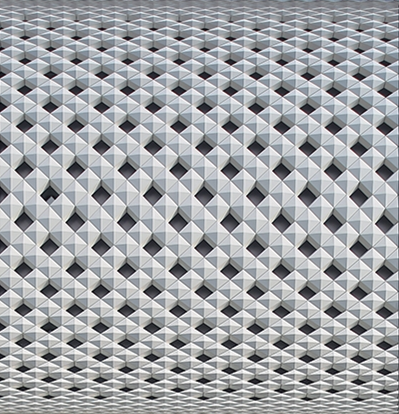
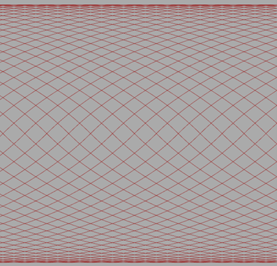
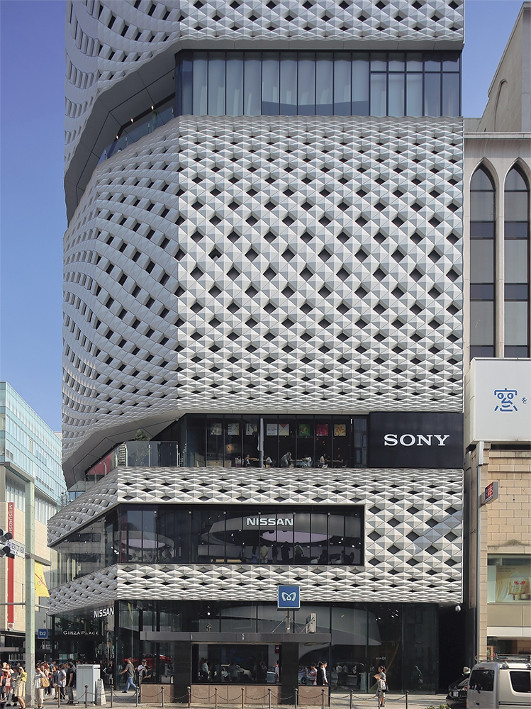
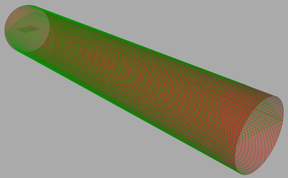
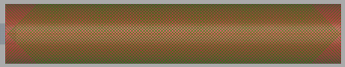
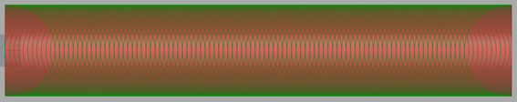
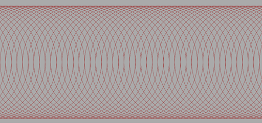
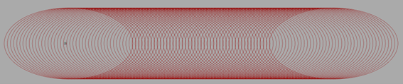
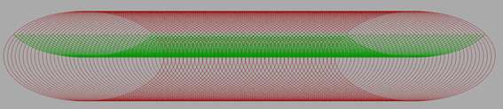
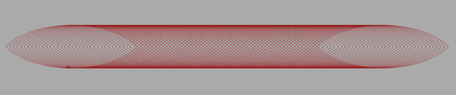

# GINZA PLACEの編み込みパターンの再現
  

　端に行くほど密になる編込みのようなGINZA PLACEのファサードのパターンは、何らかの幾何学的な規則をもって作られているように見えます。GINZA PLACEのHPではこの建築の表現について「精緻さと優雅さ」[^1]という言葉で表されていますが、滑らかな曲線のパターンは直線とは異なる印象を見る人に与えます。このパターンを、個人的な推察により、幾何学的な操作での再現を試みました。 
## パターンの再現
  
　この不思議なパターンについて、ホームページでは"透かし彫りの真っ白な器を両手で持ち上げたような"[^1]と表現されています。確かに、透かし彫りの器を真横から見ると、GINZA PLACEのファサードと同様の、端部に行くほど密になる編込みのようなパターンが観察出来ます。ですが、GINZA PLACEのパターンは２次元平面上のパターンであり、３次元空間にある立体物である透かし彫りの器とは幾何学的には異なります。では何がこの二つの形状を結びつけているのでしょうか？ 
 
 ## ３次元立体物の投影
　私たちは普段3DのCGソフトを使用する際、画面上のオブジェクトを立体物として捉えています。このように平面の画面上のものを立体として捉えられるのは、「投影」という幾何学的操作によるものです。 
　投影にはいくつかの種類があり、用途によって使い分けられます。 
 
 
 
 
 
 
 
 [^1]: [GINZA PLACEホームページ](https://ginzaplace.jp/about/)
